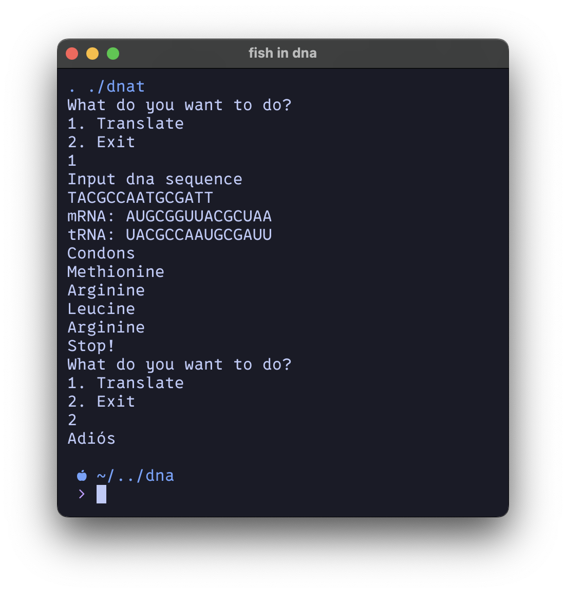

# Dnat or The DNA Translator
Dnat is a command line utility written in go to translate DNA mRNA and tRNA's nitrogenous bases to one another.
- Git clone the repo
- Then run `go build .` in the directory

